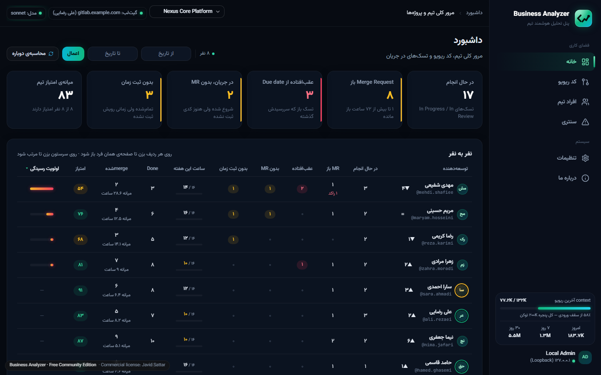
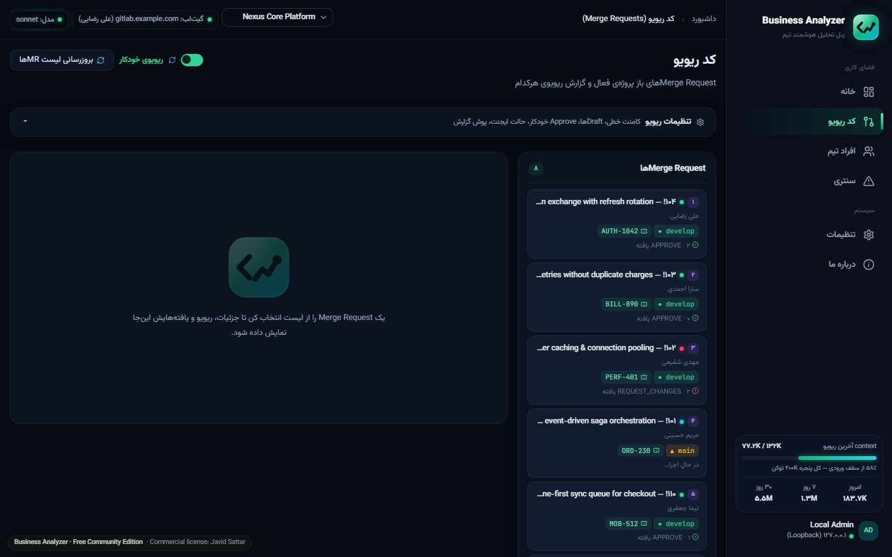
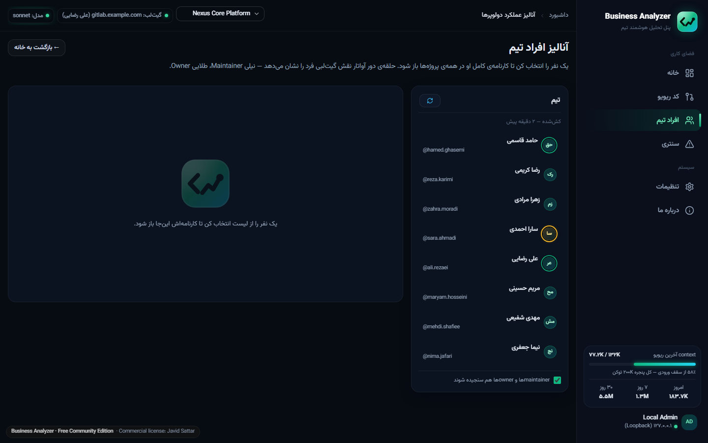
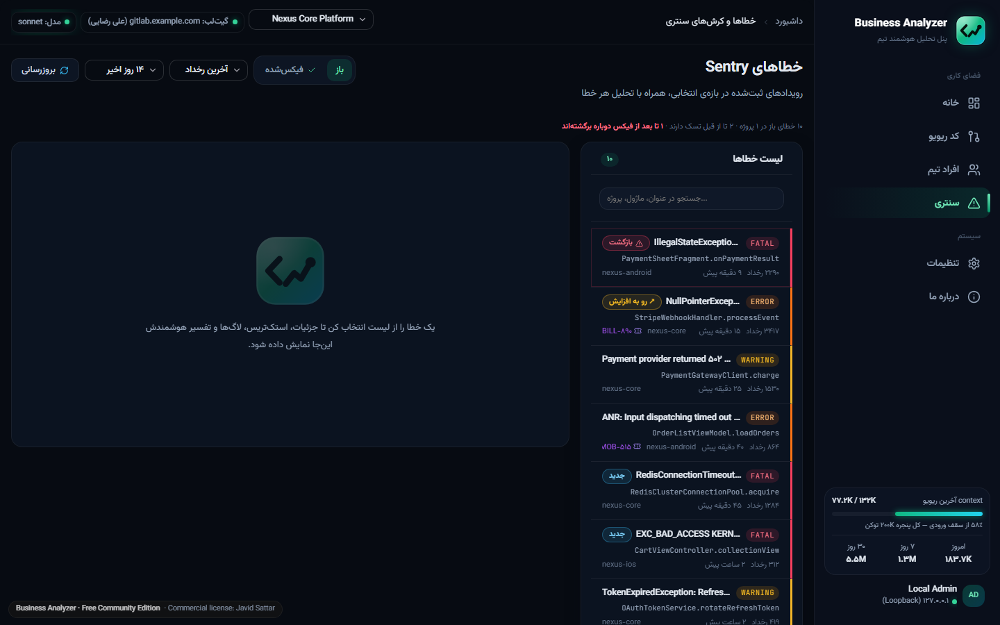
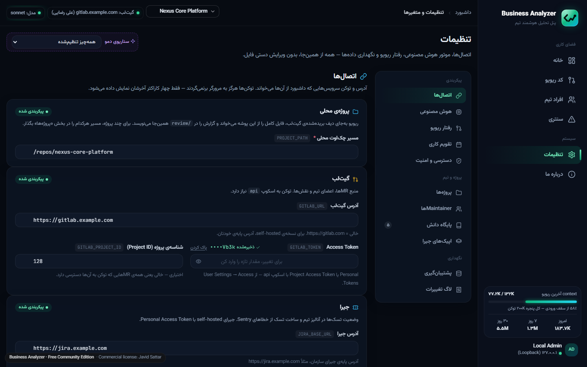
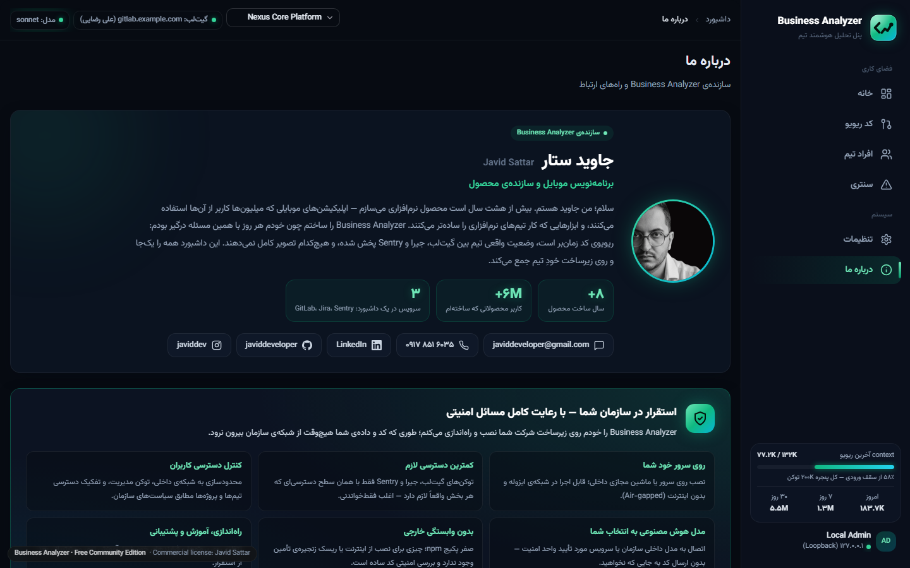
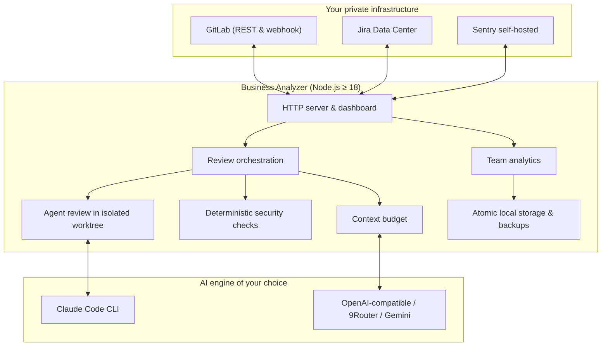

# Business Analyzer

**Autonomous AI Code Review & Engineering Team Intelligence for GitLab, Jira and Sentry.** 
*Self-hosted. Zero external npm dependencies. 100% private to your infrastructure.*

### 🟢 [**→ Live Demo — try it now, no install needed**](https://javiddeveloper.github.io/Business-Analyzer-DEMO/)

[**Live Demo**](https://javiddeveloper.github.io/Business-Analyzer-DEMO/) • [**Screenshots**](#-interface) • [**Capabilities**](#-core-capabilities) • [**Architecture**](#%EF%B8%8F-architecture) • [**Get it for your organization**](#-get-it-for-your-organization)

---

## ⚡ What is Business Analyzer?

Senior engineers and tech leads spend **15+ hours every week** reviewing code by hand. Meanwhile, engineering managers piece together the state of their team from GitLab, Jira and Sentry separately.

**Business Analyzer** solves both with a single self-hosted engine:

1. **Autonomous AI code review** — an AI agent opens a full checkout of each merge request, explores the whole project (callers, tests, the previous implementation of the same feature), runs deterministic security checks, and writes a review report in **your team's own format**.
2. **Unified engineering intelligence** — merge requests, Jira tasks and worklogs, and Sentry production errors in one dashboard, with fair per-person analytics.

> [!IMPORTANT]
> **Zero cloud exfiltration**: your source code and API tokens **never** leave your servers. Built for regulated organizations and teams on self-hosted GitLab.

---

## ⏱️ Try It in 60 Seconds

> **[→ Open the live demo](https://javiddeveloper.github.io/Business-Analyzer-DEMO/)** — runs entirely in your browser on built-in sample data. No server, no credentials, no setup.

| Page | Link | What to look at |
|---|---|---|
| Overview | [#home](https://javiddeveloper.github.io/Business-Analyzer-DEMO/#home) | Open work, overdue tasks, MRs without logged time, team scores |
| Code review | [#review](https://javiddeveloper.github.io/Business-Analyzer-DEMO/#review) | Open MR !107 or !101 to watch a review stream live; !109 for findings with a concrete failure scenario |
| Team | [#devs](https://javiddeveloper.github.io/Business-Analyzer-DEMO/#devs) | Per-person score, Jira tasks, delays, logged hours; switch project to see a separate team |
| Sentry | [#sentry](https://javiddeveloper.github.io/Business-Analyzer-DEMO/#sentry) | Regressed and escalating errors, stack traces, breadcrumbs, one-click Jira task |
| Settings | [#settings](https://javiddeveloper.github.io/Business-Analyzer-DEMO/#settings) | Connections, AI engines with a connection test, review behaviour, working days, backups, audit log |
| About | [#about](https://javiddeveloper.github.io/Business-Analyzer-DEMO/#about) | On-premise deployment |

**Demo scenarios** — the same product in other situations:

- [Fresh install](https://javiddeveloper.github.io/Business-Analyzer-DEMO/?scenario=fresh#settings) — nothing configured yet
- [Half configured](https://javiddeveloper.github.io/Business-Analyzer-DEMO/?scenario=partial#settings) — missing tokens, an engine without a key, a stale backup
- [Services down](https://javiddeveloper.github.io/Business-Analyzer-DEMO/?scenario=errors#settings) — GitLab/Jira timeouts, disk errors, a rate-limited engine

---

## 📸 Interface

| Team overview | AI code review |
| :---: | :---: |
|  |  |
| *Attention triage and delivery at a glance.* | *Merge order, Jira task and review state for every open MR.* |

| Developer analytics | Sentry triage |
| :---: | :---: |
|  |  |
| *Balanced metrics with sample-size confidence.* | *Regressions, escalations and one-click Jira tasks.* |

| Settings | On-premise deployment |
| :---: | :---: |
|  |  |
| *Validated connections, engine tests, unsaved-change tracking.* | *Installed inside your network, with your security rules.* |

---

## 🎯 Who Is This For?

- **Engineering managers & tech leads** — cut merge-request turnaround and get objective, fair growth metrics for the team.
- **CTOs & technical founders** — relieve senior engineers of review burnout and catch credential leaks before production, without per-seat SaaS costs.
- **Self-hosted GitLab & Jira teams** — teams that cannot use cloud review tools because of data sovereignty, banking compliance or air-gapped networks.

---

## 🌟 Core Capabilities

### 1. Deep AI code review — not just a diff matcher
- **Whole-project agent review** — each MR is checked out into an isolated, read-only worktree; the agent searches callers, consumers and tests, and compares business flow against the previous implementation.
- **Follows your own review process** — if the project keeps a review guide and report template, the agent reads them and writes the report exactly in that format and language, round after round, on the MR's own branch.
- **Live output** — watch the agent read files and write its findings as it works.
- **Deterministic machine checks** — secrets, tokens and private keys are flagged independently of the model.
- **Engine fallback** — if one AI engine is out of quota, the review continues on the next configured one and says so in the report.
- **Measured accuracy** — the team votes 👍/👎 on findings; precision is computed from real votes.
- **Merge-order auto-approve** — approves a clean review only when earlier MRs are approved. **Never merges.**

### 2. Fair developer analytics
- **Balanced 6-factor model** — on-time delivery, estimation accuracy, code quality, task completion, worklog discipline, single-author branches.
- **Confidence discounting** — a sample-size factor of n / (n + 5), so a single MR never swings a score.
- **Symmetric estimation penalty** — padding is penalized as much as under-estimating.
- **Working-day aware** — delays are counted in your organization's working days.
- **Excel export and printable reports**, built natively.

### 3. Sentry triage & Jira tasks
- Prioritizes production errors by frequency and affected users; flags regressions and escalations.
- AI root-cause analysis from the stack trace and breadcrumbs.
- One click creates a structured Jira task, under the right epic, with the full error context.

### 4. Built for operations
- Multiple projects, each optionally with its own GitLab / Jira / Sentry connection.
- Settings with validation, connection tests, an audit log of every change, and daily backups.
- Works with Claude Code, any OpenAI-compatible endpoint (including your own internal gateway), 9Router or Gemini.

---

## 🥊 How It Compares

| Dimension | Cloud AI bots (CodeRabbit, Qodo) | Engineering analytics (LinearB, Jellyfish) | **Business Analyzer** |
| :--- | :---: | :---: | :---: |
| **Hosting** | Vendor cloud | Vendor cloud | **100% on-premise** |
| **Code privacy** | Source sent to cloud | Metadata sent to cloud | **Never leaves your network** |
| **Review depth** | Diff context | None (metrics only) | **Whole-project agent review** |
| **Your review process** | Generic format | — | **Your own guide & template** |
| **Sentry + Jira loop** | No | Basic webhooks | **AI diagnosis & one-click task** |
| **Dependencies** | Hundreds of packages | Agents & SaaS | **0 npm packages** |

---

## 🏛️ Architecture

---

## 🏢 Get It for Your Organization

This repository contains only the public demo. **Business Analyzer is a commercial product**, installed on your own servers by its author, with your security and access requirements:

- On-premise installation, including air-gapped networks
- Integration with your internal AI gateway or private models
- Your review rules, Jira workflows and team structure
- Architecture consulting and technical leadership

**Contact — Javid Sattar**
- 📧 [javiddeveloper@gmail.com](mailto:javiddeveloper@gmail.com?subject=Business%20Analyzer)
- 💼 [LinkedIn](https://www.linkedin.com/in/javid-sattar/)
- 🐙 [GitHub @javiddeveloper](https://github.com/javiddeveloper)

---

## 🇮🇷 Business Analyzer به فارسی

ریویوی هوشمند کد، تحلیل عملکرد تیم و پیگیری خطاهای production روی GitLab، Jira و Sentry — روی سرور خود سازمان.

- **ریویوی ایجنتی کل پروژه** — نه فقط دیف؛ فراخوان‌ها، تست‌ها و پیاده‌سازی قبلی همان قابلیت را هم می‌خواند.
- **طبق فرایند و قالب ریویوی خود تیم** گزارش می‌نویسد و روی شاخه‌ی همان MR می‌گذارد.
- **خروجی زنده** — روند ریویو را همان لحظه می‌بینید.
- **تحلیل منصفانه‌ی عملکرد تیم** بر اساس تسک‌ها، زمان ثبت‌شده و کیفیت کد، با احتساب روزهای کاری سازمان.
- **از خطای Sentry تا تسک جیرا با یک کلیک.**
- **کد و داده از شبکه‌ی سازمان خارج نمی‌شود.**

**[▶ باز کردن دموی آنلاین](https://javiddeveloper.github.io/Business-Analyzer-DEMO/)** — بدون ثبت‌نام و نصب؛ همه‌چیز با داده‌ی نمونه در مرورگر اجرا می‌شود.

این مخزن فقط نسخه‌ی نمایشی است. خود محصول تجاری است و روی زیرساخت سازمان شما، با رعایت کامل مسائل امنیتی و دسترسی‌ها، نصب می‌شود. برای استقرار در سازمان: [javiddeveloper@gmail.com](mailto:javiddeveloper@gmail.com?subject=Business%20Analyzer)

---

© Javid Sattar. All rights reserved. This demo is provided for evaluation only; the product source is not included.
